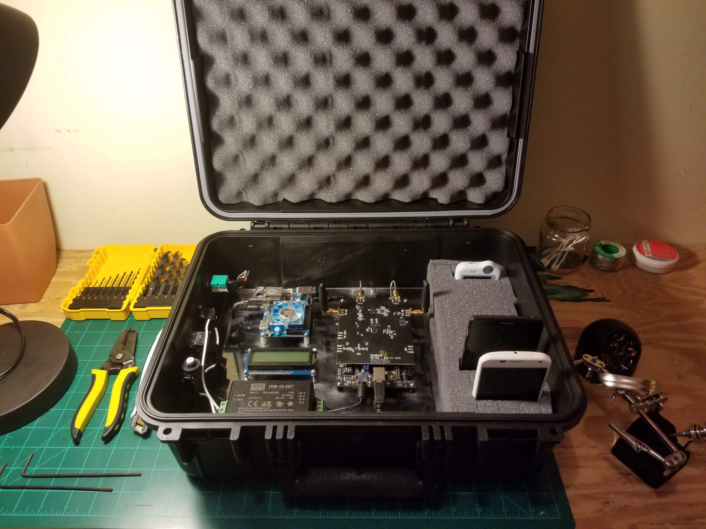

# Portable Cell Initiative
An open-source software and hardware project to build portable micro-cells for deployment in disaster areas where power, internet, and infrastructure is destroyed.

After several hurricanes earlier this year, Puerto Rico, Houston, and other areas in the United States remain devastated. During and after such tragedies entire communities are left without critical resources, including any way to contact the outside world. Cellular service, a system taken for granted in everyday life, becomes a crucial tool for calling for emergencies, coordinating responses, directing aid, and contacting loved ones. Even regularly working cellular networks can collapse, as when cellular networks were overloaded and temporary paralyzed after the Boston marathon bombing. After natural catastrophes so severe that power lines and cell towers are destroyed, locals may be unable to request assistance, contact family members and friends, and coordinate rebuilding efforts while emergency workers become effectively stranded and unable to communicate for long periods of time.

The “Portable Cell Initiative”, tackles the challenge by developing a small, portable, and light system that acts as a temporary cell tower. These small units, called "microcells" can create a resilient network and be set up with no experience (plug-and-play).

## Features
* Connects to mobile devices through 2G protocol and allows calling, SMS, Internet connection without new SIM cards
* Easy-to-use web portal for mobile users links emergency responders and provides critical information include maps and emergency updates
* Connected to existing satellite constellation infrastructure
* Works anywhere on the planet with no re-configuration
* No dependance on existing infrastructure or power
* Can survive harsh temperature and weather conditions
* Can interconnect with other nearby microcells to create a larger network
* Flexible design
* Cheap and based on open-sourced hardware and software

## More information

#### [Complete Project Proposal](https://github.com/Ironarcher/portable-cell-initiative/blob/master/documentation/Project%20Proposal.pdf)

### Design and Technical Documents and Schematics
* [CAD Drawings](https://github.com/Ironarcher/portable-cell-initiative/tree/master/structural_CAD)
* [Networking Diagram](https://drive.google.com/file/d/1F7UjbKQFGlt_Ugc90fcQds3FkP_MWMTc/view?usp=sharing)
* [Safety Recommendations](https://github.com/Ironarcher/portable-cell-initiative/raw/master/documentation/Safety%20Recommendations.docx)
* [Properties of the Recommended Antenna](https://github.com/Ironarcher/portable-cell-initiative/raw/master/documentation/Antenna%20Analysis.docx)
* [Circuit Diagram](https://drive.google.com/file/d/19UB1lHhNbGaFvCO_THeIRcXM_tuGDZBh/view?usp=sharing)
* [Antenna Range and Estimation of user capacity](https://github.com/Ironarcher/portable-cell-initiative/raw/master/documentation/Range%20and%20Subscriber%20Analysis.docx)

### Software Development
The Software-defined Radio utilizes OpenBTS and YateBTS to process GSM signals.

The Linux server uses a custom configuration of Ubuntu 14 (Odroid XU4 compatible release). Visit the software page for a README with installation instructions.

#### Additional features available

- Set up instructions to enable config GUI web page and operation with BladeRF radios
- Custom YateBTS configuration files and scripts for disaster relief use
- Firewall configurations to limit idle network usage and connect to the master server
- Integration with Flowroute and its API for international calling
- GPRS configuration for enabling data service
- Automatic phone number assignment to users
- Informational display code (for use with USB serial displays)
- Code for network testing, temperature testing, other procedures

#### Captive Portal
-The Captive Portal technology, a lightweight web application that opens when users first connect to the cell tower, provides quick information to users and a twitter feed of curated information about the situation. This is part of our strategy to reduce network congestion and limit over-use of backhaul resources. Users can always opt to leave the page and access the Internet, returning to the page at any time.

[Find the code and contribute](https://github.com/Ironarcher/beamlink_captiveportal)

#### In Progress:
- VPN Setup guide between master server and cellular base stations
- Integration with Flowroute SMS API for international texting
- Automatic Flowroute number purchase and number management with OpenBTS
- Switching from GPRS to UMTS data service (3G) based on OpenBTS's UMTS package
- Release of multi-tower communication architecture
- RRLP tracking to allow first responders to locate people in emergency situations based on their cell phone's position (cellular triangulation) - Part of emergency calling as well
- E911 integration (for users to connect to the correct 911 operator in their area)
- Maia: A web service that provides a bird-eye view of our cellular towers connected together, laid on top of Google Maps. View each cell tower's location in proximity to others, and configure their network settings on-the-fly. Have direct access to each tower through built-in SSH capability. Create zones and divide frequencies to reduce cross-tower interference and manage handover settings. Edit automatic phone number systems and receive notifications if the tower malfunctions. Live readouts of pertinent information like core temperatures, number of active connections, new registrations, CPU usage, frequency congestion information, and more.

### Competitions and Challenges
[Mozilla and the National Science Foundation's Wireless Innovation for a Networked Society (Off the Grid Challenge)](https://wirelesschallenge.mozilla.org/#winners) - Honorable Mention

[USC Min Family Social Entrepreneurship Challenge 2017](http://viterbiundergrad.usc.edu/min/) - Finalist

- [People before Profits - USC Viterbi Magazine](https://magazine.viterbi.usc.edu/spring-2018/student-life/people-before-profits/)
