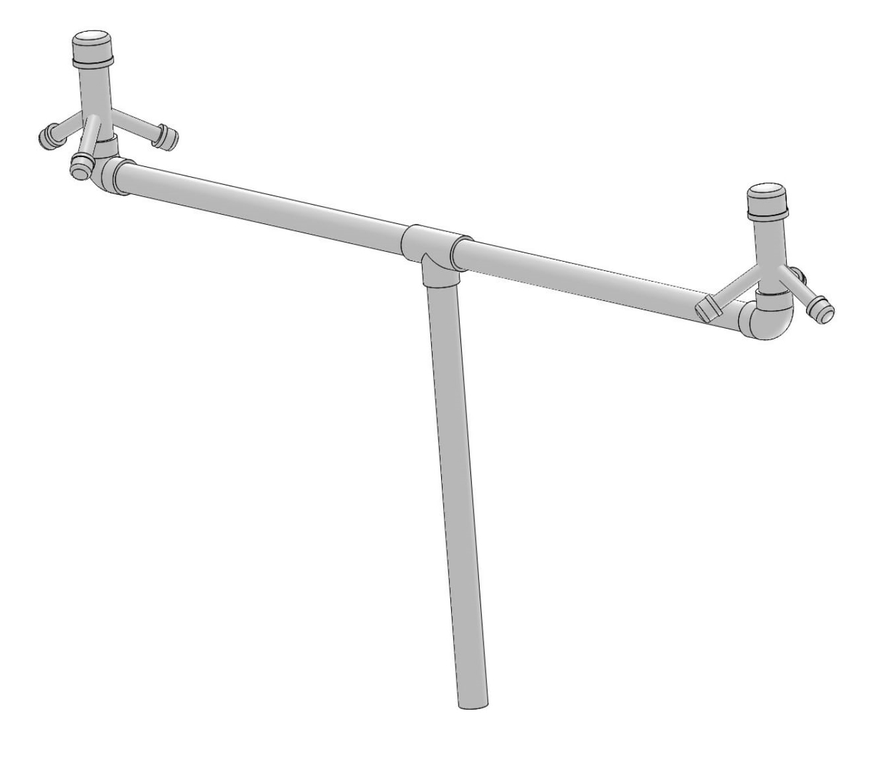

# Portable Cell Initiative
An open-source software and hardware project to build portable micro-cells for deployment in disaster areas where power, internet, and infrastructure is destroyed.

After several hurricanes earlier this year, Puerto Rico, Houston, and other areas in the United States remain devastated. During and after such tragedies entire communities are left without critical resources, including any way to contact the outside world. Cellular service, a system taken for granted in everyday life, becomes a crucial tool for calling for emergencies, coordinating responses, directing aid, and contacting loved ones. Even regularly working cellular networks can collapse, as when cellular networks were overloaded and temporary paralyzed after the Boston marathon bombing. After natural catastrophes so severe that power lines and cell towers are destroyed, locals may be unable to request assistance, contact family members and friends, and coordinate rebuilding efforts while emergency workers become effectively stranded and unable to communicate for long periods of time.

The “Portable Cell Initiative”, tackles the challenge by developing a small, portable, and light system that acts as a temporary cell tower. These small units, called "microcells" can create a resilient network and be operated with little experience.

## Features
* Connects to mobile devices through 2G protocol and allows calling, SMS, Internet connection without new SIM cards
* Easy-to-use web portal for mobile users links emergency responders and provides critical information include maps and emergency updates
* Connected to existing satellite constellation infrastructure
* Works anywhere on the planet with no re-configuration
* No dependance on existing infrastructure or power
* Can survive harsh temperature and weather conditions
* Can interconnect with other nearby microcells to create a larger network
* Flexible design
* Cheap and based on open-sourced hardware and software

## More information

### Additional Documents
* [Introductory Powerpoint](https://drive.google.com/open?id=1aGqGCh3v1vU4eB8DhiBI95E3DqyPoUFu)
* [Complete Project Proposal](https://drive.google.com/open?id=1P7SBx1yV2n8gCgzejELNr3f8qNV_H3i-8C9I9dhl-e8)
* [CAD Drawings](https://github.com/Ironarcher/portable-cell-initiative/tree/master/modeling)
* [Networking Diagram](https://github.com/Ironarcher/portable-cell-initiative/blob/master/Portable%20Cell%20Initiative%20Network%20Diagram.png)
* [Safety Recommendations](https://github.com/Ironarcher/portable-cell-initiative/blob/master/Safety%20Recommendations.docx?raw=true)
* [Properties of the Recommended Antenna](https://github.com/Ironarcher/portable-cell-initiative/blob/master/Antenna%20Analysis.docx)
* [Circuit Diagram](https://github.com/Ironarcher/portable-cell-initiative/blob/master/PCI%20Circuit%20Diagram%20-%20Page%201.png)
* [Antenna Range and Estimation of user capacity](https://github.com/Ironarcher/portable-cell-initiative/blob/master/Range%20and%20Subscriber%20Analysis.docx)

### Software Development
The Software-defined Radio utilizes OpenBTS to process GSM signals.

The Linux server uses custom configuration (Ubuntu 14.04 Server edition) and run with `setup.sh`. More features, such as the web server, firewall configuration, and RRLP tracking are in progress.

### Competitions and Challenges
Pending submission Wireless Innovation for a Networked Society Challenge by Mozilla and the National Science Foundation
Off-the-Grid Internet Challenge and

USC Min Family Social Entrepreneurship Challenge 2017
